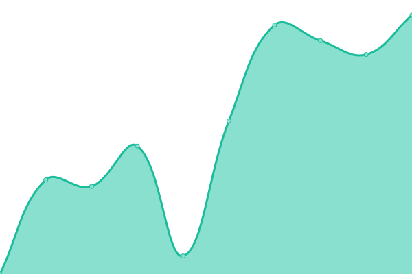

# [📈 Live Status](https://surgeoftheages.github.io/sasup): <!--live status--> **🟧 Partial outage**

This repository contains the open-source uptime monitor and status page for [surgeoftheages](https://surgeoftheages.github.io/sasup), powered by [Upptime](https://github.com/upptime/upptime).

With [Upptime](https://upptime.js.org), you can get your own unlimited and free uptime monitor and status page, powered entirely by a GitHub repository. We use [Issues](https://github.com/surgeoftheages/sasup/issues) as incident reports, [Actions](https://github.com/surgeoftheages/sasup/actions) as uptime monitors, and [Pages](https://surgeoftheages.github.io/sasup) for the status page.

<!--start: status pages-->
<!-- This summary is generated by Upptime (https://github.com/upptime/upptime) -->
<!-- Do not edit this manually, your changes will be overwritten -->
<!-- prettier-ignore -->
| URL | Status | History | Response Time | Uptime |
| --- | ------ | ------- | ------------- | ------ |
|  [Aurosociety](https://aurosociety.org) | 🟩 Up | [aurosociety.yml](https://github.com/surgeoftheages/sasup/commits/HEAD/history/aurosociety.yml) | 

 798ms
     
 | 

<a href="https://surgeoftheages.github.io/sasup/history/aurosociety">100.00%</a>
    

|  [Aurobharati](https://aurobharati.in) | 🟥 Down | [aurobharati.yml](https://github.com/surgeoftheages/sasup/commits/HEAD/history/aurobharati.yml) | 

 115ms
     
 | 

<a href="https://surgeoftheages.github.io/sasup/history/aurobharati">0.00%</a>
    

|  [AuroPublications](https://auropublications.org) | 🟩 Up | [auro-publications.yml](https://github.com/surgeoftheages/sasup/commits/HEAD/history/auro-publications.yml) | 

 3237ms
     
 | 

<a href="https://surgeoftheages.github.io/sasup/history/auro-publications">100.00%</a>
    

|  [Renaissance](https://journal.aurobharati.in) | 🟩 Up | [renaissance.yml](https://github.com/surgeoftheages/sasup/commits/HEAD/history/renaissance.yml) | 

 891ms
     
 | 

<a href="https://surgeoftheages.github.io/sasup/history/renaissance">100.00%</a>
    

|  [Sanjeevan](https://sanjeevanpalliativecare.org/) | 🟩 Up | [sanjeevan.yml](https://github.com/surgeoftheages/sasup/commits/HEAD/history/sanjeevan.yml) | 

 783ms
     
 | 

<a href="https://surgeoftheages.github.io/sasup/history/sanjeevan">100.00%</a>
    

|  [INGH](https://internationalgh.com/) | 🟩 Up | [ingh.yml](https://github.com/surgeoftheages/sasup/commits/HEAD/history/ingh.yml) | 

 1543ms
     
 | 

<a href="https://surgeoftheages.github.io/sasup/history/ingh">0.00%</a>
    

|  [Sea Side GH](https://seasidegh.com/) | 🟩 Up | [sea-side-gh.yml](https://github.com/surgeoftheages/sasup/commits/HEAD/history/sea-side-gh.yml) | 

 1606ms
     
 | 

<a href="https://surgeoftheages.github.io/sasup/history/sea-side-gh">0.00%</a>
    

|  [Retreat GH](http://theretreatgh.com/) | 🟩 Up | [retreat-gh.yml](https://github.com/surgeoftheages/sasup/commits/HEAD/history/retreat-gh.yml) | 

 1312ms
     
 | 

<a href="https://surgeoftheages.github.io/sasup/history/retreat-gh">100.00%</a>
    

<!--end: status pages-->

[**Visit our status website →**](https://surgeoftheages.github.io/sasup)

## 📄 License

- Powered by: [Upptime](https://github.com/upptime/upptime)
- Code: [MIT](./LICENSE) © [surgeoftheages](https://surgeoftheages.github.io/sasup)
- Data in the `./history` directory: [Open Database License](https://opendatacommons.org/licenses/odbl/1-0/)
